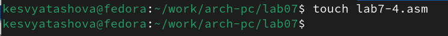

---
## Front matter
title: "Отчёт по лабораторной работе № 7"
subtitle: "дисциплина: Архитектура компьютера. Команды безусловного и условного переходов в Nasm. Программирование ветвлений"
author: "Студент: Святашова Ксения Евгеньевна"

## Generic otions
lang: ru-RU
toc-title: "Содержание"

## Bibliography
bibliography: bib/cite.bib
csl: pandoc/csl/gost-r-7-0-5-2008-numeric.csl

## Pdf output format
toc: true # Table of contents
toc-depth: 2
lof: true # List of figures
fontsize: 13pt
linestretch: 1.5
papersize: a4
documentclass: scrreprt
## I18n polyglossia
polyglossia-lang:
  name: russian
  options:
	- spelling=modern
	- babelshorthands=true
polyglossia-otherlangs:
  name: english
## I18n babel
babel-lang: russian
babel-otherlangs: english
## Fonts
mainfont: IBM Plex Serif
romanfont: IBM Plex Serif
sansfont: IBM Plex Sans
monofont: IBM Plex Mono
mathfont: STIX Two Math
mainfontoptions: Ligatures=Common,Ligatures=TeX,Scale=0.94
romanfontoptions: Ligatures=Common,Ligatures=TeX,Scale=0.94
sansfontoptions: Ligatures=Common,Ligatures=TeX,Scale=MatchLowercase,Scale=0.94
monofontoptions: Scale=MatchLowercase,Scale=0.94,FakeStretch=0.9
mathfontoptions:
## Biblatex
biblatex: true
biblio-style: "gost-numeric"
biblatexoptions:
  - parentracker=true
  - backend=biber
  - hyperref=auto
  - language=auto
  - autolang=other*
  - citestyle=gost-numeric
## Pandoc-crossref LaTeX customization
figureTitle: "Рис."
tableTitle: "Таблица"
listingTitle: "Листинг"
lofTitle: "Список иллюстраций"
lolTitle: "Листинги"
## Misc options
indent: true
header-includes:
  - \usepackage{indentfirst}
  - \usepackage{float} # keep figures where there are in the text
  - \floatplacement{figure}{H} # keep figures where there are in the text
---

# Цель работы

Целью работы является изучение команд условного и безусловного переходов, приобретение навыков написания программ с использованием переходов и знакомство с назначением и структурой файла листинга.

# Теоритическое введение

Для реализации ветвлений в ассемблере используются так называемые команды передачи управления или команды перехода. Можно выделить 2 типа переходов:

• условный переход – выполнение или не выполнение перехода в определенную точку программы в зависимости от проверки условия.

• безусловный переход – выполнение передачи управления в определенную точку программы без каких-либо условий.

Безусловный переход выполняется инструкцией jmp (от англ. jump – прыжок), которая включает в себя адрес перехода, куда следует передать управление. Адрес перехода может быть либо меткой, либо адресом области памяти, в которую предварительно помещен указатель перехода. Кроме того, в качестве операнда можно использовать имя регистра, в таком случае переход будет осуществляться по адресу, хранящемуся в этом регистре.

Для условного перехода необходима проверка какого-либо условия. В ассемблере команды условного перехода вычисляют условие перехода анализируя флаги из регистра флагов. Флаг – это бит, принимающий значение 1 («флаг установлен»), если выполнено некоторое условие, и значение 0 («флаг сброшен») в противном случае. Флаги работают независимо друг от друга, и лишь для удобства они помещены в единый регистр — регистр флагов, отражающий текущее состояние процессора.

Инструкция cmp является одной из инструкций, которая позволяет сравнить операнды и выставляет флаги в зависимости от результата сравнения. Инструкция cmp является командой сравнения двух операндов и имеет такой же формат, как и команда вычитания.

Листинг (в рамках понятийного аппарата NASM) — это один из выходных файлов, создаваемых транслятором. Он имеет текстовый вид и нужен при отладке программы, так как кроме строк самой программы он содержит дополнительную информацию.

Все ошибки и предупреждения, обнаруженные при ассемблировании, транслятор выводит на экран, и файл листинга не создаётся.

Структура листинга:

• номер строки — это номер строки файла листинга (нужно помнить, что номер строки в файле листинга может не соответствовать номеру строки в файле с исходным текстом программы);

• адрес — это смещение машинного кода от начала текущего сегмента;

• машинный код представляет собой ассемблированную исходную строку в виде шестнадцатеричной последовательности. (например, инструкция int 80h начинается по смещению 00000020 в сегменте кода; далее идёт машинный код, в который ассемблируется инструкция, то есть инструкция int 80h ассемблируется в CD80 (в шестнадцатеричном представлении); CD80 — это инструкция на машинном языке, вызывающая прерывание ядра);

• исходный текст программы — это просто строка исходной программы вместе с комментариями (некоторые строки на языке ассемблера, например, строки, содержащие только комментарии, не генерируют никакого машинного кода, и поля «смещение» и «исходный текст программы» в таких строках отсутствуют, однако номер строки им присваивается).

# Выполнение лабораторной работы

## Реализация переходов в NASM

1. Создадим каталог для программам лабораторной работы № 7, перейдем в него и создадим файл lab7-1.asm(рис. [-@fig:001]):

{#fig:001 width=90%}

2. Инструкция jmp в NASM используется для реализации безусловных переходов. Рассмотрим пример программы с использованием инструкции jmp. Введем в файл lab7-1.asm текст программы из листинга 7.1.(рис. [-@fig:002]):

{#fig:002 width=90%}

**Листинг 7.1. Программа с использованием инструкции jmp**

%include 'in_out.asm' ; подключение внешнего файла

SECTION .data

msg1: DB 'Сообщение № 1',0

msg2: DB 'Сообщение № 2',0

msg3: DB 'Сообщение № 3',0

SECTION .text

GLOBAL _start

_start:

jmp _label2

_label1:

mov eax, msg1 ; Вывод на экран строки

call sprintLF ; 'Сообщение № 1'

_label2:

mov eax, msg2 ; Вывод на экран строки

call sprintLF ; 'Сообщение № 2'

_label3:

mov eax, msg3 ; Вывод на экран строки

call sprintLF ; 'Сообщение № 3'

_end:

call quit ; вызов подпрограммы завершения

Создадим исполняемый файл и запустим его(рис. [-@fig:003]):

{#fig:003 width=90%}

Таким образом, использование инструкции jmp _label2 меняет порядок исполнения инструкций и позволяет выполнить инструкции начиная с метки _label2, пропустив вывод первого сообщения.

Изменим программу так, чтобы она выводила сначала ‘Сообщение № 2’, потом ‘Сообщение № 1’ и завершала работу. Для этого в текст программы после вывода сообщения № 2 добавим
инструкцию jmp с меткой _label1 (т.е. переход к инструкциям вывода сообщения № 1) и после вывода сообщения № 1 добавим инструкцию jmp с меткой _end (т.е. переход к инструкции call quit). 

Изменим текст программы в соответствии с листингом 7.2.(рис. [-@fig:004]):

{#fig:004 width=90%}

**Листинг 7.2. Программа с использованием инструкции jmp**

%include 'in_out.asm' ; подключение внешнего файла

SECTION .data

msg1: DB 'Сообщение № 1',0

msg2: DB 'Сообщение № 2',0

msg3: DB 'Сообщение № 3',0

SECTION .text

GLOBAL _start

_start:

jmp _label2

_label1:

mov eax, msg1 ; Вывод на экран строки

call sprintLF ; 'Сообщение № 1'

jmp _end

label2:

mov eax, msg2 ; Вывод на экран строки

call sprintLF ; 'Сообщение № 2'

jmp _label1

_label3:

mov eax, msg3 ; Вывод на экран строки

call sprintLF ; 'Сообщение № 3'

_end:

call quit ; вызов подпрограммы завершения

Создадим исполняемый файл и запустим его(рис. [-@fig:005]):

{#fig:005 width=90%}

Изменим текст программы(рис. [-@fig:006]) добавив или изменив инструкции jmp, чтобы вывод программы был следующим(рис. [-@fig:007]):

{#fig:006 width=90%}

{#fig:007 width=90%}

3. . Использование инструкции jmp приводит к переходу в любом случае. Однако, часто при написании программ необходимо использовать условные переходы, т.е. переход должен происходить если выполнено какое-либо условие. В качестве примера рассмотрим программу, которая определяет и выводит на экран наибольшую из 3 целочисленных переменных: A,B и C. Значения для A и C задаются в программе, значение B вводиться с клавиатуры.

Создадим файл lab7-2.asm в каталоге ~/work/arch-pc/lab07(рис. [-@fig:008]):

{#fig:008 width=90%}

Далее в этот файл введем текст программы из листинга 7.3(рис. [-@fig:009]):

{#fig:009 width=90%}

**Листинг 7.3. Программа, которая определяет и выводит на экран наибольшую из 3 целочисленных переменных: A,B и C.**

%include 'in_out.asm'

section .data

msg1 db 'Введите B: ',0h

msg2 db "Наибольшее число: ",0h

A dd '20'

C dd '50'

section .bss

max resb 10

B resb 10

section .text

global _start

_start:

; ---------- Вывод сообщения 'Введите B: '

mov eax,msg1

call sprint

; ---------- Ввод 'B'

mov ecx,B

mov edx,10

call sread

; ---------- Преобразование 'B' из символа в число

mov eax,B

call atoi ; Вызов подпрограммы перевода символа в число

mov [B],eax ; запись преобразованного числа в 'B'

; ---------- Записываем 'A' в переменную 'max'

mov ecx,[A] ; 'ecx = A'

mov [max],ecx ; 'max = A'

; ---------- Сравниваем 'A' и 'С' (как символы)

cmp ecx,[C] ; Сравниваем 'A' и 'С'

jg check_B ; если 'A>C', то переход на метку 'check_B',

mov ecx,[C] ; иначе 'ecx = C'

mov [max],ecx ; 'max = C'

; ---------- Преобразование 'max(A,C)' из символа в число

check_B:

mov eax,max

call atoi ; Вызов подпрограммы перевода символа в число

mov [max],eax ; запись преобразованного числа в `max`

; ---------- Сравниваем 'max(A,C)' и 'B' (как числа)

mov ecx,[max]

cmp ecx,[B] ; Сравниваем 'max(A,C)' и 'B'

jg fin ; если 'max(A,C)>B', то переход на 'fin',

mov ecx,[B] ; иначе 'ecx = B'

mov [max],ecx

; ---------- Вывод результата

fin:

mov eax, msg2

call sprint ; Вывод сообщения 'Наибольшее число: '

mov eax,[max]

call iprintLF ; Вывод 'max(A,B,C)'

call quit ; Выход

Создадим исполняемый файл и запустим его для разных значений B (рис. [-@fig:010]) и (рис. [-@fig:011]):

{#fig:010 width=90%}

{#fig:011 width=90%}

## Изучение структуры файлы листинга

4. Обычно nasm создаёт в результате ассемблирования только объектный файл. Получить файл листинга можно, указав ключ -l и задав имя файла листинга в командной строке.

Создадим файл листинга для программы из файла lab7-2.asm(рис. [-@fig:012]) и откроем этот файл с помощью текстового редактора mcedit(рис. [-@fig:013]):

{#fig:012 width=90%}

{#fig:013 width=90%}

Внимательно ознакомившись с форматом и содержимым файла листинга, можно объяснить содержимое его строк. Например:

1) Это строка(рис. [-@fig:014]) находится находится на 22 месте, ее адрес "00000106", машинный код - "E891FFFFFF". call atoi означает, вызов подпрограммы перевода символа, лежащего в строке выше, в число.

{#fig:014 width=90%}

2) Это строка(рис. [-@fig:015]) находится находится на 25 месте, ее адрес "00000110", машинный код - "8BOD[35000000]". mov ecx,[A] означает, что в регистр ecx мы записываем число, хранящееся в переменной A.

{#fig:015 width=90%}

3) Это строка(рис. [-@fig:016]) находится находится на 36 месте, ее адрес "00000135", машинный код - "A3[00000000]". mov [max],eax означает, запись преобразованного числа из регистра eax в max.

{#fig:016 width=90%}

В строке mov eax,max я удалила операнду max и попробывала выполните трансляцию с получением файла листинга(рис. [-@fig:017]):

{#fig:017 width=90%}

При трансляции файла выходит ошибка, потому что для корректной работы программы нужно два операнда. В файле листинга показывается, где совершена ошибка и почему она выходит(рис. [-@fig:018]):

{#fig:018 width=90%}

# Задания для самостоятельной работы

1. Создадим файл lab7-3.asm для выполнения первого задания самостоятельной работы(рис. [-@fig:019]):

{#fig:019 width=90%}

Напишем программу(рис. [-@fig:020]) нахождения наименьшей из 3 целочисленных переменных a,b и c. Значения переменных я выбрала в соответствии с вариантом, полученным при выполнении лабораторной работы № 6. Мой вариант - 9. 

{#fig:020 width=90%}

Создадим исполняемый файл и проверим его работу(рис. [-@fig:021])

{#fig:021 width=90%}

2. Создадим файл lab7-4.asm для выполнения второго задания самостоятельной работы(рис. [-@fig:022]):

{#fig:022 width=110%}

Напишем программу(рис. [-@fig:023]), которая для введенных с клавиатуры значений x и a вычисляет значение заданной функции f(x) и выводит результат вычислений. Вид функции f(x) я выбрала также в соответствии с вариантом, полученным при выполнении лабораторной работы № 6. 

{#fig:023 width=110%}

Создадим исполняемый файл и проверьте его работу для значений x и a(рис. [-@fig:024]) и (рис. [-@fig:025]):

{#fig:024 width=110%}

{#fig:025 width=110%}

Текст программы:

%include 'in_out.asm'

SECTION .data

prim1 DB 'a+x, x<=a' ,0

prim2 DB 'a, x>a',0

X1 DB 'Введите значение x: ',0

A1 DB 'Введите значение a: ',0

otv DB 'Ответ: ',0

SECTION .bss

X RESB 20

A RESB 20

F RESB 20

SECTION .text

GLOBAL _start

_start:

mov eax,prim1

call sprintLF

mov eax,prim2

call sprintLF

mov eax,X1

call sprint

mov ecx,X

mov edx,10

call sread

mov eax,X

call atoi

mov [X],eax

mov eax,A1

call sprint

mov ecx,A

mov edx,10

call sread

mov eax,A

call atoi

mov [A],eax

mov ecx,[X]

mov [F],ecx

cmp [A],ecx

jg check_or

mov eax,[A]

mov [F],eax

jmp fin

check_or:

mov eax,[X]

add eax,[A]

mov [F],eax

fin:

mov eax,otv

call sprint

mov eax,[F]

call iprintLF
call quit

# Вывод

В результате выполнения работы я изучила команды условного и безусловного переходов, приобрела навыки написания программ с использованием переходов и познакомилась с назначением и структурой файла листинга.

