---
## Front matter
title: "Отчёт по лабораторной работе № 8"
subtitle: "дисциплина: Архитектура компьютера. Программирование цикла. Обработка аргументов командной строки"
author: "Студент: Святашова Ксения Евгеньевна"

## Generic otions
lang: ru-RU
toc-title: "Содержание"

## Bibliography
bibliography: bib/cite.bib
csl: pandoc/csl/gost-r-7-0-5-2008-numeric.csl

## Pdf output format
toc: true # Table of contents
toc-depth: 2
lof: true # List of figures
fontsize: 13pt
linestretch: 1.5
papersize: a4
documentclass: scrreprt
## I18n polyglossia
polyglossia-lang:
  name: russian
  options:
	- spelling=modern
	- babelshorthands=true
polyglossia-otherlangs:
  name: english
## I18n babel
babel-lang: russian
babel-otherlangs: english
## Fonts
mainfont: IBM Plex Serif
romanfont: IBM Plex Serif
sansfont: IBM Plex Sans
monofont: IBM Plex Mono
mathfont: STIX Two Math
mainfontoptions: Ligatures=Common,Ligatures=TeX,Scale=0.94
romanfontoptions: Ligatures=Common,Ligatures=TeX,Scale=0.94
sansfontoptions: Ligatures=Common,Ligatures=TeX,Scale=MatchLowercase,Scale=0.94
monofontoptions: Scale=MatchLowercase,Scale=0.94,FakeStretch=0.9
mathfontoptions:
## Biblatex
biblatex: true
biblio-style: "gost-numeric"
biblatexoptions:
  - parentracker=true
  - backend=biber
  - hyperref=auto
  - language=auto
  - autolang=other*
  - citestyle=gost-numeric
## Pandoc-crossref LaTeX customization
figureTitle: "Рис."
tableTitle: "Таблица"
listingTitle: "Листинг"
lofTitle: "Список иллюстраций"
lolTitle: "Листинги"
## Misc options
indent: true
header-includes:
  - \usepackage{indentfirst}
  - \usepackage{float} # keep figures where there are in the text
  - \floatplacement{figure}{H} # keep figures where there are in the text
---

# Цель работы

Целью работы является приобретение навыков написания программ с использованием циклов и обработкой аргументов командной строки.

# Теоритическое введение

Стек —это структура данных, организованная по принципу LIFO («Last In — First Out» или «последним пришёл—первым ушёл»).Стек является частью архитектуры процессора и реализован на аппаратном уровне. Для работы со стеком в процессоре есть специальные регистры (ss,bp,sp) и команды.

Основной функцией стека является функция сохранения адресов возврата и передачи аргументов при вызове процедур. Кроме того, в нём выделяется память для локальных переменных и могут временно храниться значения регистров.

Для стека существует две основные операции:
 
• добавление элемента в вершину стека (push);

• извлечение элемента из вершины стека (pop).

Команда push размещает значение в стеке, т.е.помещает значение в ячейку памяти, на которую указывает регистр esp, после этого значение регистра esp увеличивается на 4. Данная команда имеет один операнд—значение, которое необходимо поместить в стек.

Команда pop извлекает значение из стека, т.е. извлекает значение из ячейки памяти, на которую указывает регистр esp, после этого уменьшает значение регистра esp на 4. У этой команды также один операнд, который может быть регистром или переменной в памяти.

Аналогично команде записи в стек существует команда popa, которая восстанавливает из стека все регистры общего назначения, и команда popf для перемещения значений из вершины стека в регистр флагов.

Для организации циклов существуют специальные инструкции. Для всех инструкций максимальное количество проходов задаётся в регистре ecx. Наиболее простой является инструкция loop. Она позволяет организовать безусловный цикл.

Иструкция loop выполняется в два этапа.Сначала из регистра ecx вычитается единица и его значение сравнивается с нулём. Если регистр не равен нулю, то выполняется переход к указанной метке. Иначе переход не выполняется и управление передаётся команде, которая следует сразу после команды loop.

# Выполнение лабораторной работы

## Реализация циклов в NASM

Создадим каталог для программ лабораторной работы №8, перейдем в него и создадим файл lab8-1.asm(рис. [-@fig:001]):

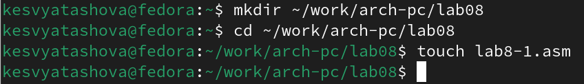{#fig:001 width=90%}

При реализации циклов в NASM с использованием инструкции loop необходимо помнить о том, что эта инструкция использует регистр ecx в качестве счетчика и на каждом шаге уменьшает его значение на единицу.

Введем в файл lab8-1.asm текст программы из листинга 8.1.(рис. [-@fig:002]):

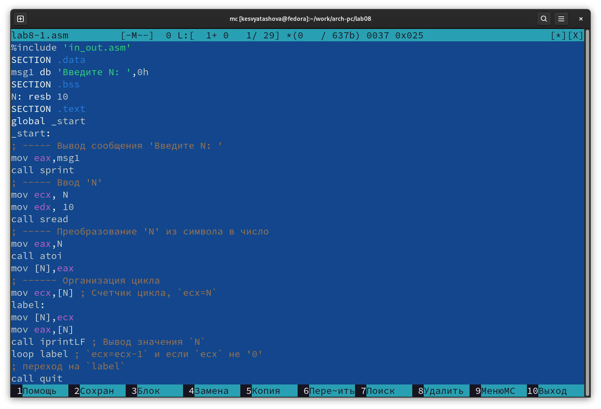{#fig:002 width=90%}

**Листинг 8.1. Программа вывода значений регистра ecx**

%include 'in_out.asm'

SECTION .data

msg1 db 'Введите N: ',0h

SECTION .bss

N:    resb 10

SECTION .text

global _start

_start:

;----- Вывод сообщения 'Введите N: '

mov eax,msg1

call sprint

;----- Ввод 'N'

mov ecx, N

mov edx, 10

call sread

;----- Преобразование 'N' из символа в число

mov eax,N

call atoi

mov [N],eax

;------ Организация цикла

mov ecx,[N]  ; Счетчик цикла, `ecx=N`

label:

mov [N],ecx

mov eax,[N]

call

iprintLF  ; Вывод значения `N`

loop label

call

quit

Создадим исполняемый файл и проверим его работу(рис. [-@fig:003]):

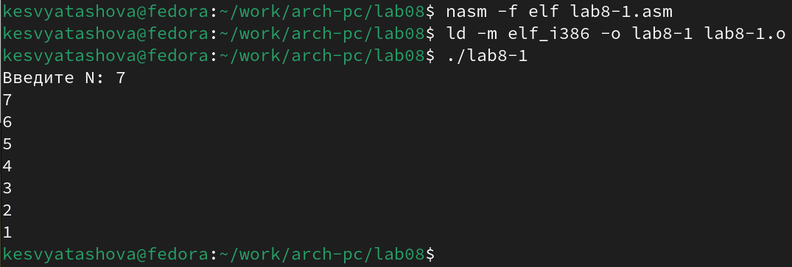{#fig:003 width=90%}

Данный пример показывает, что использование регистра ecx в теле цилка loop может привести к некорректной работе программы.

Изменим текст программы(рис. [-@fig:004]), добавив изменение значение регистра ecx в цикле:

label:
 
 sub ecx,1   ; `ecx=ecx-1
 
 mov [N],ecx
 
 mov eax,[N]
 
 call iprintLF

 loop label

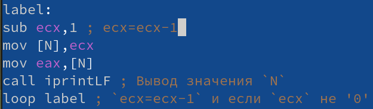{#fig:004 width=90%}

Создадим исполняемый файл и запустим его(рис. [-@fig:005]):

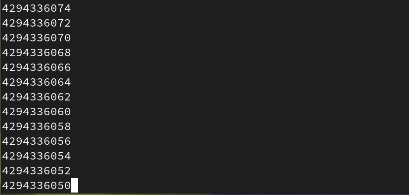{#fig:005 width=90%}

При данном изменении программы цикл закольцевался и стал бесконечным.

Внесем изменения(рис. [-@fig:006]) в текст программы, добавив команды push и pop(добавления в стек и извлечения из стека) для сохранения значения счетчика цикла loop:

label:

push ecx    ; добавление значения ecx в стек

sub ecx,1

mov [N],ecx

mov eax,[N]

call iprintLF

pop ecx     ; извлечение значения ecx из стека

loop label

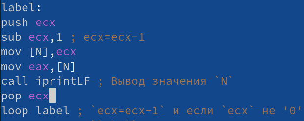{#fig:006 width=90%}

Создадим исполняемый файл и проверим его работу(рис. [-@fig:007]):

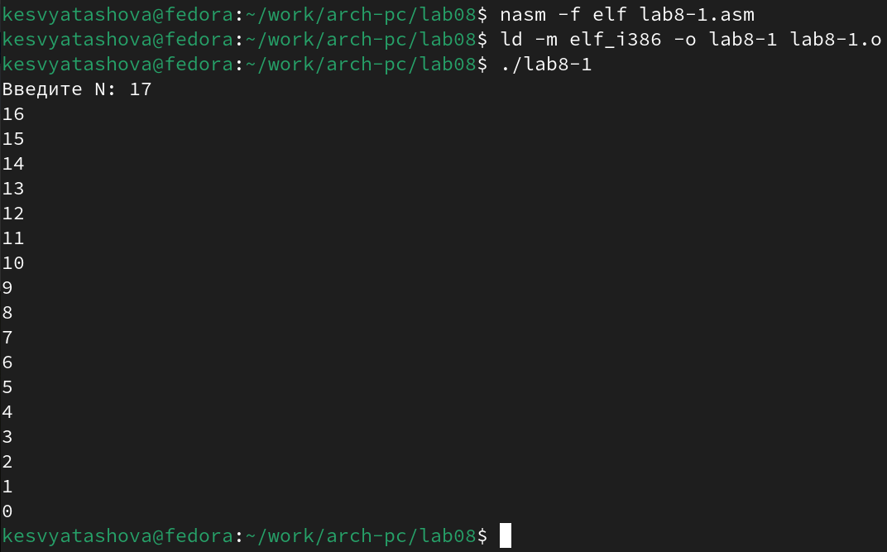{#fig:007 width=90%}

Теперь, после изменения программы, число циклов стало соответствовать числу, введенному с клавиатуры.

## Обработка аргументов командной строки

При разработке программ иногда встает необходимость указывать аргументы, которые будут использоваться в программе, непосредственно из командной строки при запуске программы.

При запуске программы в NASM аргументы командной строки загружаются в стек в обратном порядке, кроме того в стек записывается имя программы и общее количество аргументов. Последние два элемента стека для программы, скомпилированной NASM,–это всегда имя программы и количество переданных аргументов.

Таким образом, для того чтобы использовать аргументы в программе, их нужно извлечь из стека. Обработку аргументов нужно проводитьв цикле. Т.е. сначала нужно извлечь из стека количество аргументов, а затем циклично для каждого аргумента выполнить логику программы.

Создадим файл lab8-2.asm(рис. [-@fig:008]) в каталоге ~/work/arch-pc/lab08 и введем в него текст программы из листинга 8.2.(рис. [-@fig:009]):

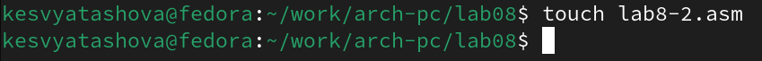{#fig:008 width=90%}

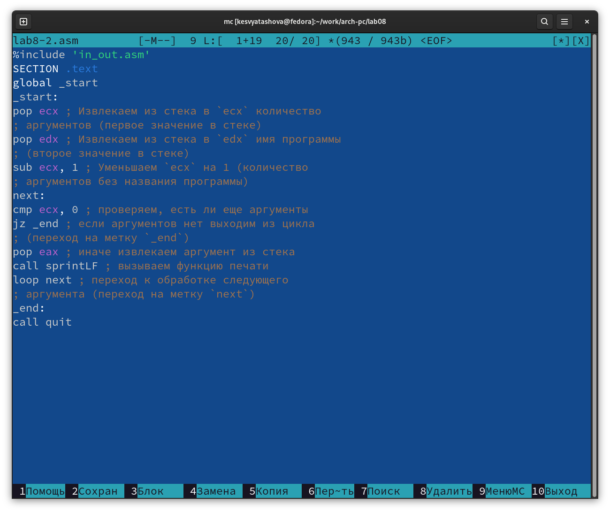{#fig:009 width=90%}

**Листинг 8.2. Программа выводящая на экран аргументы командной строки**

%include 'in_out.asm'

SECTION .text

global _start

_start:

pop ecx 

pop edx

sub ecx, 1 

next:

cmp ecx, 0 

jz _end 

pop eax 

call sprintLF 

loop next

_end:

call quit

Создадим исполняемый файл и запустим его, указав аргументы(рис. [-@fig:010]):

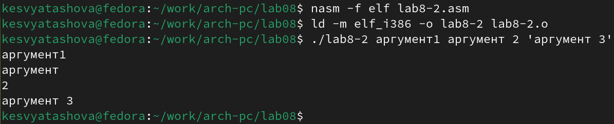{#fig:010 width=90%}

Программой было обработано 4 аргумента.

Создадим файл lab8-3.asm(рис. [-@fig:011]) в каталоге ~/work/archpc/lab08 и введем в него текст программы из листинга 8.3.(рис. [-@fig:012]):

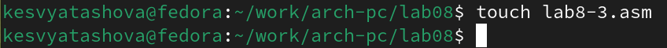{#fig:011 width=90%}

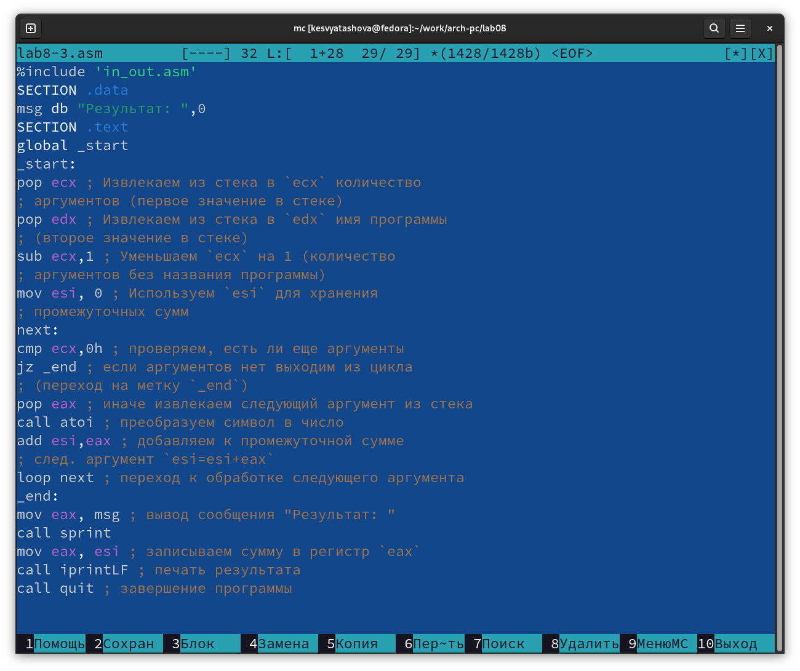{#fig:012 width=90%}

**Листинг 8.3. Программа вычисления суммы аргументов командной строки**

%include 'in_out.asm'

SECTION .data

msg db "Результат: ",0

SECTION .text

global _start

_start:

pop ecx 
 
pop edx

sub ecx,1 

mov esi, 0
 
next:

cmp ecx,0h 

jz _end

pop eax

call atoi
 
add esi,eax 

loop next

_end:

mov eax, msg 

call sprint

mov eax, esi 

call iprintLF 

call quit

Создадим исполняемый файл и запустим его, указав аргументы(рис. [-@fig:013]):

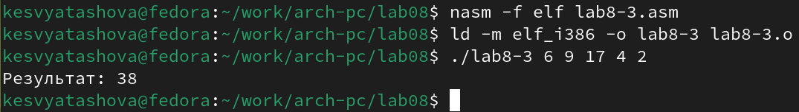{#fig:013 width=90%}

Изменим текст программы из листинга 8.3 для вычисления произведения аргументов командной строки(рис. [-@fig:014]):

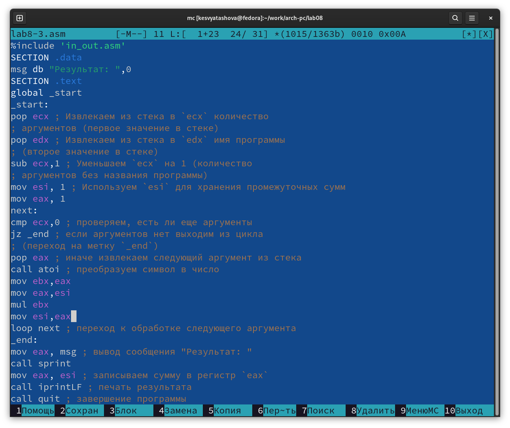{#fig:014 width=90%}

Создадим исполняемый файл и запустим его, указав аргументы(рис. [-@fig:015]):

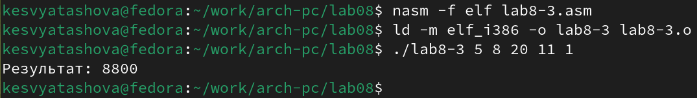{#fig:015 width=90%}

# Задания для самостоятельной работы

1. Создадим файл для выполнения самостоятельной работы(рис. [-@fig:016]):

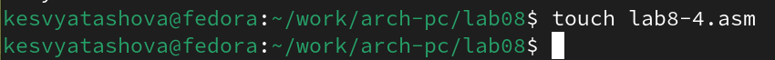{#fig:016 width=90%}

Напишем программу(рис. [-@fig:017]), которая находит сумму значений функции f(x) для x=x1,x2,...,xn, т.е. программа должна выводить значение f(x1)+f(x2)+...+f(xn). Значения xi передаются как аргументы. Вид функции f(x) я выбрала в соответствии с вариантом, полученным при выполнении лабораторной работы № 6. Мой вариант-9, значит моя функция: 10x-4. 

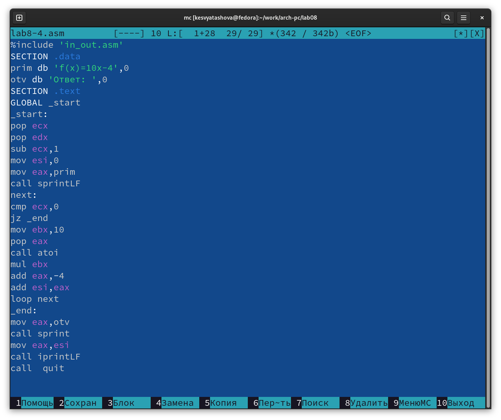{#fig:017 width=90%}

Текст программы:

%include 'in_out.asm'

SECTION .data

prim db 'f(x)=10x-4',0

otv db 'Ответ: ',0

SECTION .text

GLOBAL _start

_start:

pop ecx

pop edx

sub ecx,1

mov esi,0

mov eax,prim

call sprintLF

next:

cmp ecx,0

jz _end

mov ebx,10

pop eax

call atoi

mul ebx

add eax,-4

add esi,eax

loop next

_end:

mov eax,otv

call sprint

mov eax,esi

call iprintLF

call  quit

Создадим исполняемый файл и проверим его работу на нескольких наборах x=x1,x2,...,xn.(рис. [-@fig:018]) и (рис. [-@fig:019]):

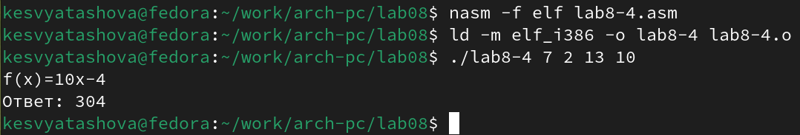{#fig:018 width=90%}

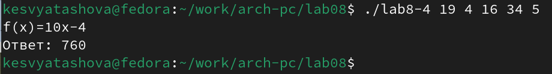{#fig:019 width=90%}

# Вывод

В результате выполнения работы я приобрела навыки написания программ с использованием циклов и обработкой аргументов командной строки.

