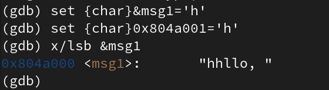

---
## Front matter
title: "Отчёт по лабораторной работе № 9"
subtitle: "дисциплина: Архитектура компьютера. Понятие подпрограммы. Отладчик GDB."
author: "Студент: Святашова Ксения Евгеньевна"

## Generic otions
lang: ru-RU
toc-title: "Содержание"

## Bibliography
bibliography: bib/cite.bib
csl: pandoc/csl/gost-r-7-0-5-2008-numeric.csl

## Pdf output format
toc: true # Table of contents
toc-depth: 2
lof: true # List of figures
fontsize: 13pt
linestretch: 1.5
papersize: a4
documentclass: scrreprt
## I18n polyglossia
polyglossia-lang:
  name: russian
  options:
	- spelling=modern
	- babelshorthands=true
polyglossia-otherlangs:
  name: english
## I18n babel
babel-lang: russian
babel-otherlangs: english
## Fonts
mainfont: IBM Plex Serif
romanfont: IBM Plex Serif
sansfont: IBM Plex Sans
monofont: IBM Plex Mono
mathfont: STIX Two Math
mainfontoptions: Ligatures=Common,Ligatures=TeX,Scale=0.94
romanfontoptions: Ligatures=Common,Ligatures=TeX,Scale=0.94
sansfontoptions: Ligatures=Common,Ligatures=TeX,Scale=MatchLowercase,Scale=0.94
monofontoptions: Scale=MatchLowercase,Scale=0.94,FakeStretch=0.9
mathfontoptions:
## Biblatex
biblatex: true
biblio-style: "gost-numeric"
biblatexoptions:
  - parentracker=true
  - backend=biber
  - hyperref=auto
  - language=auto
  - autolang=other*
  - citestyle=gost-numeric
## Pandoc-crossref LaTeX customization
figureTitle: "Рис."
tableTitle: "Таблица"
listingTitle: "Листинг"
lofTitle: "Список иллюстраций"
lolTitle: "Листинги"
## Misc options
indent: true
header-includes:
  - \usepackage{indentfirst}
  - \usepackage{float} # keep figures where there are in the text
  - \floatplacement{figure}{H} # keep figures where there are in the text
---

# Цель работы

Целью работы является приобретение навыков написания программ с использованием подпрограмм и знакомство с методами отладки при помощи GDB и его основными возможностями.

# Теоритическое введение

Отладка — это процесс поиска и исправления ошибок в программе. В общем случае его можно разделить на четыре этапа:

• обнаружение ошибки;

• поиск её местонахождения;

• определение причины ошибки;

• исправление ошибки.

Можно выделить следующие типы ошибок:

• синтаксические ошибки — обнаруживаются во время трансляции исходного кода и вызваны нарушением ожидаемой формы или структуры языка;

• семантические ошибки — являются логическими и приводят к тому, что программа запускается, отрабатывает, но не даёт желаемого результата;

• ошибки в процессе выполнения — не обнаруживаются при трансляции и вызывают прерывание выполнения программы (например, это ошибки, связанные с переполнением или делением на ноль).

Второй этап — поиск местонахождения ошибки. Некоторые ошибки обнаружить довольно трудно. Лучший способ найти место в программе, где находится ошибка, это разбить программу на части и произвести их отладку отдельно друг от друга.

Третий этап — выяснение причины ошибки. После определения местонахождения ошибки обычно проще определить причину неправильной работы программы.

Последний этап — исправление ошибки. После этого при повторном запуске программы, может обнаружиться следующая ошибка, и процесс отладки начнётся заново.

Наиболее часто применяют следующие методы отладки:

• создание точек контроля значений на входе и выходе участка программы (например, вывод промежуточных значений на экран — так называемые диагностические сообщения);

• использование специальных программ-отладчиков.

Отладчик GDB (как и любой другой отладчик) позволяет увидеть, что происходит «внутри» программы в момент её выполнения или что делает программа в момент сбоя.

GDB может выполнять следующие действия:

• начать выполнение программы, задав всё, что может повлиять на её поведение;

• остановить программу при указанных условиях;

• исследовать, что случилось, когда программа остановилась;

• изменить программу так, чтобы можно было поэкспериментировать с устранением эффектов одной ошибки и продолжить выявление других.

Если есть файл с исходным текстом программы, а в исполняемый файл включена информация о номерах строк исходного кода, то программу можно отлаживать, работая в отладчике непосредственно с её исходным текстом. Чтобы программу можно было отлаживать на уровне строк исходного кода, она должна быть откомпилирована с ключом -g.

Для продолжения остановленной программы используется команда continue (c) (gdb) с [аргумент]. Выполнение программы будет происходить до следующей точки останова.

Подпрограмма — это, как правило, функционально законченный участок кода, который можно многократно вызывать из разных мест программы. В отличие от простых переходов из подпрограмм существует возврат на команду, следующую за вызовом.

# Выполнение лабораторной работы

## Реализация подпрограмм в NASM

1. Создадим каталог для выполнения лабораторной работы № 9, перейдем в него и создайте файл lab09-1.asm:(рис. [-@fig:001]):

{#fig:001 width=90%}

2. В качестве примера рассмотрим программу вычисления арифметического выражения f(x) = 2x + 7 с помощью подпрограммы _calcul. В данном примере x вводится с клавиатуры, а само выражение вычисляется в подпрограмме. 

Введем в файл lab09-1.asm текст программы из листинга 9.1.(рис. [-@fig:002]):

{#fig:002 width=90%}

**Листинг 9.1. Пример программы с использованием вызова подпрограммы**

%include 'in_out.asm'

SECTION .data

msg: DB 'Введите x: ',0

result: DB '2x+7=',0

SECTION .bss

x: RESB 80

res: RESB 80

SECTION .text

GLOBAL _start

_start:

;------------------------------------------

; Основная программа

;------------------------------------------

mov eax, msg

call sprint

mov ecx, x

mov edx, 80

call sread

mov eax,x

call atoi

call _calcul ; Вызов подпрограммы _calcul

mov eax,result

call sprint

mov eax,[res]

call iprintLF

call quit

;------------------------------------------

; Подпрограмма вычисления

; выражения "2x+7"

_calcul:

mov ebx,2

mul ebx

add eax,7

mov [res],eax

ret ; выход из подпрограммы

Создадим исполняемый файл и проверим его работу(рис. [-@fig:003]):

{#fig:003 width=90%}

Изменим текст программы(рис. [-@fig:004]), добавив подпрограмму _subcalcul в подпрограмму _calcul, для вычисления выражения f(g(x)), где x вводится с клавиатуры, f(x) = 2x + 7, g(x) = 3x − 1. Т.е. x передается в подпрограмму _calcul из нее в подпрограмму _subcalcul, где вычисляется выражение g(x), результат возвращается в _calcul и вычисляется выражение f(g(x)). Результат возвращается в основную программу для вывода результата на экран.

{#fig:004 width=90%}

Текст программы:

%include 'in_out.asm'

SECTION .data

msg: DB 'Введите x: ',0

prim1: DB 'f(x)=2x+7',0

prim2: DB 'g(x)=3x-1',0

result: DB 'f(g(x))=',0

SECTION .bss

x: RESB 80

res: RESB 80

SECTION .text

GLOBAL _start

_start:

mov eax,prim1

call sprintLF

mov eax,prim2

call sprintLF

mov eax, msg

call sprint

mov ecx, x

mov edx, 80

call sread

mov eax,x

call atoi

call _calcul ; Вызов подпрограммы _calcul

mov eax,result

call sprint

mov eax,[res]

call iprintLF

call quit

_calcul:

call _subcalcul

mov ebx,2

mul ebx

add eax,7

mov [res],eax

ret ; выход из подпрограммы

_subcalcul:

mov ebx,3

mul ebx

add eax,-1

mov [res],eax

ret

Создадим исполняемый файл и проверим его работу(рис. [-@fig:005]):

{#fig:005 width=90%}

## Отладка программам с помощью GDB

Создадим файл lab09-2.asm(рис. [-@fig:006]) с текстом программы из Листинга 9.2.(рис. [-@fig:007])(Программа печати сообщения Hello world!):

{#fig:006 width=90%}

{#fig:007 width=90%}

**Листинг 9.2. Программа вывода сообщения Hello world!**

SECTION .data

msg1: db "Hello, ",0x0

msg1Len: equ $ - msg1

msg2: db "world!",0xa

msg2Len: equ $ - msg2

SECTION .text

global _start

_start:

mov eax, 4

mov ebx, 1

mov ecx, msg1

mov edx, msg1Len

int 0x80

mov eax, 4

mov ebx, 1

mov ecx, msg2

mov edx, msg2Len

int 0x80

mov eax, 1

mov ebx, 0

int 0x80

Получим исполняемый файл. Для работы с GDB в исполняемый файл необходимо добавить отладочную информацию, для этого трансляцию программ необходимо проводить с ключом
‘-g’(рис. [-@fig:008]):

{#fig:008 width=90%}

Загрузим исполняемый файл в отладчик gdb(рис. [-@fig:009]):

{#fig:009 width=90%}

Проверим работу программы, запустив ее в оболочке GDB с помощью команды run (сокращённо r)(рис. [-@fig:010]):

{#fig:010 width=90%}

Для более подробного анализа программы установим брейкпоинт на метку _start, с которой начинается выполнение любой ассемблерной программы, и запустим её(рис. [-@fig:011]):

{#fig:011 width=90%}

Посмотрим дисассимилированный код программы с помощью команды disassemble начиная с метки _start(рис. [-@fig:012]):

{#fig:012 width=90%}

Переключимся на отображение команд с Intel’овским синтаксисом, введя команду set disassembly-flavor intel(рис. [-@fig:013]):

{#fig:013 width=90%}

Различия отображения синтаксиса машинных команд в режимах ATT и Intel заключаются в командах. В диссамилированном отображении в командах используюся "%" и "$" , а в Intel этих символов нет. На это отображение удобнее смотреть. 

Включим режим псевдографики для более удобного анализа программы(рис. [-@fig:014]) с помощью комманд:

(gdb) layout asm

(gdb) layout regs

{#fig:014 width=90%}

В этом режиме есть три окна:

• В верхней части видны названия регистров и их текущие значения;

• В средней части виден результат дисассимилирования программы;

• Нижняя часть доступна для ввода команд.

### Добавление точек останова

На предыдущих шагах была установлена точка останова по имени метки (_start). Проверим это с помощью команды info breakpoints (кратко i b)(рис. [-@fig:015]):

{#fig:015 width=90%}

Установим еще одну точку останова по адресу инструкции(рис. [-@fig:016]):

{#fig:016 width=90%}

Посмотрим информацию о всех установленных точках останова(рис. [-@fig:017]):

{#fig:017 width=90%}

### Работа с данными программы в GDB

Отладчик может показывать содержимое ячеек памяти и регистров, а при необходимости позволяет вручную изменять значения регистров и переменных.

С помощью команды si посмотрим регистры и изменим их(рис. [-@fig:018]):

{#fig:018 width=90%}

Измененные регистры выглядят так(рис. [-@fig:019]):

{#fig:019 width=90%}

Для отображения содержимого памяти можно использовать команду x <адрес>, которая выдаёт содержимое ячейки памяти по указанному адресу. Формат, в котором выводятся данные, можно задать после имени команды через косую черту: x/NFU <адрес>. 

С помощью команды x &<имя переменной> также можно посмотреть содержимое переменной.

Посмотрим значение переменной msg1 по имени(рис. [-@fig:020]):

{#fig:020 width=90%}

Посмотрим значение переменной msg2 по адресу(рис. [-@fig:021]):

{#fig:021 width=90%}

Изменить значение для регистра или ячейки памяти можно с помощью команды set, задав ей в качестве аргумента имя регистра или адрес. При этом перед именем регистра ставится префикс $, а перед адресом нужно указать в фигурных скобках тип данных.

Изменим первый символ переменной msg1(рис. [-@fig:022]):

{#fig:022 width=90%}

Изменим символ переменной msg2(рис. [-@fig:023]):

{#fig:023 width=90%}

С помощью команды set изменим значение регистра ebx(рис. [-@fig:024]):

{#fig:024 width=90%}

Команда выводит два разных значения, потому что в первый раз мы вносим значение 2, а во второй - регистр равен двум, поэтому значения отличаются.

Завершим выполнение программы с помощью команды continue (сокращенно c) или stepi (сокращенно si) и выйдем из GDB с помощью команды quit (сокращенно q)(рис. [-@fig:025]):

{#fig:025 width=90%}

### Обработка аргументов командной строки в GDB

Скопируем файл lab8-2.asm, созданный при выполнении лабораторной работы №8, с программой выводящей на экран аргументы командной строки (Листинг 8.2) в файл с именем lab09-3.asm(рис. [-@fig:026]):

{#fig:026 width=90%}

Создадим исполняемый файл(рис. [-@fig:027]):

{#fig:027 width=90%}

Для загрузки в gdb программы с аргументами необходимо использовать ключ --args.

Загрузим исполняемый файл в отладчик, указав аргументы(рис. [-@fig:028]):

{#fig:028 width=90%}

При запуске программы аргументы командной строки загружаются в стек. Исследуем расположение аргументов командной строки в стеке после запуска программы с помощью gdb.

Для начала установим точку останова перед первой инструкцией в программе и запустим ее(рис. [-@fig:029]):

{#fig:029 width=90%}

Адрес вершины стека храниться в регистре esp и по этому адресу располагается число равное количеству аргументов командной строки (включая имя программы)(рис. [-@fig:030]):

{#fig:030 width=90%}

Как видно, число аргументов равно 5 – это имя программы lab09-3 и непосредственно аргументы: аргумент1, аргумент, 2 и 'аргумент 3'.

Посмотрим остальные позиции стека(рис. [-@fig:031]):

{#fig:031 width=90%}

Элементы расположены с интервалом в 4 единицы, потому что стек может хранить до 4 байт, и для того, чтобы данные сохранялись нормально и без помех, компьютер использует новый стек для новой информации.

# Задания для самостоятельной работы

1. Преобразуем программу из лабораторной работы №8 (Задание №1 для самостоятельной работы).

Скопируем файл и переменуем его в lab09-4.asm(рис. [-@fig:032]):

{#fig:032 width=90%}

Реализуем вычисление значения функции f(x) как подпрограмму(рис. [-@fig:033]):

{#fig:033 width=90%}

Текст программы:

%include 'in_out.asm'

SECTION .data

prim db 'f(x)=10x-4',0

otv db 'Ответ: ',0

SECTION .text

GLOBAL _start

_start:

pop ecx

pop edx

sub ecx,1

mov esi,0

mov eax,prim

call sprintLF

next:

cmp ecx,0

jz _end

pop eax

call fir

add esi,eax

loop next

_end:

mov eax,otv

call sprint

mov eax,esi

call iprintLF

call  quit

fir:

mov ebx,10

mul ebx

add eax,-4

ret

Создадим исполняемый файл и запустим его(рис. [-@fig:034]) и (рис. [-@fig:035]):

{#fig:034 width=90%}

{#fig:035 width=90%}

2. Создадим файл для решения №2 самостоятельной работы(рис. [-@fig:036]):

{#fig:036 width=90%}

В листинге 9.3 приведена программа вычисления выражения (3+2)*4+5. При запуске данная программа дает неверный результат.

**Листинг 9.3. Программа вычисления выражения (3+2)*4+5**

%include 'in_out.asm'

SECTION .data

div: DB 'Результат: ',0

SECTION .text

GLOBAL _start

_start:

; ---- Вычисление выражения (3+2)*4+5

mov ebx,3

mov eax,2

add ebx,eax

mov ecx,4

mul ecx

add ebx,5

mov edi,ebx

; ---- Вывод результата на экран

mov eax,div

call sprint

mov eax,edi

call iprintLF

call quit

Ввод текста из листинга 9.3.(рис. [-@fig:037]):

{#fig:037 width=90%}

Проверим, что программа выводит неправильный ответ(рис. [-@fig:038]):

{#fig:038 width=90%}

С помощью  отладчика GDB запустим программу(рис. [-@fig:039]):

{#fig:039 width=90%}

Проанализировав изменения значений регистров(рис. [-@fig:040]), понятно, что некоторые регистры стоят не на своих местах. 

{#fig:040 width=90%}

Исправив регистры, запустим программу(рис. [-@fig:041]):

{#fig:041 width=90%}

Теперь программа действительно выводит правильный ответ. Программа работает верно.

# Вывод

В результате выполнения работы я приобрела навыки написания программ с использованием подпрограмм и познакомилась с методами отладки при помощи GDB и его основными возможностями.

